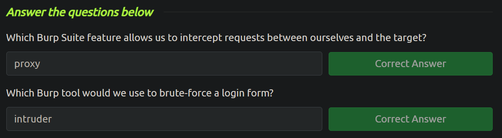

<h2>Burp Suite: The Basics</h2>

This particular room aims to understand the basics of the Burp Suite web application security testing framework. Our focus will revolve around the following key aspects:

1. A thorough introduction to Burp Suite.
2. A comprehensive overview of the various tools available within the framework.
3. Detailed guidance on the process of installing Burp Suite on your system.
4. Navigating and configuring Burp Suite.

We will also introduce the core of the Burp Suite framework, which is the Burp Proxy. It is important to note that this room primarily serves as a foundational resource for acquiring knowledge about Burp Suite. Subsequent rooms in the Burp module will adopt a more practical approach. Thus, this room will contain a greater emphasis on theoretical content. If you have not yet utilised Burp Suite, it is recommended to carefully read the provided information and actively engage with the tool. Experimentation is essential for grasping the fundamentals of this framework. Combining the information presented here with hands-on exploration will establish a strong foundation for utilising the framework. This will significantly assist you in future rooms.

<h3><u>Features of Burp Community</u></h3>

Burp Suite Community offers an impressive array of tools that are highly valuable for web application testing. Some of the key features are:

- **Proxy**: The Burp Proxy is the most renowned aspect of Burp Suite. It enables interception and modification of requests and responses while interacting with web applications.
- **Repeater**: Another well-known feature. Repeater allows for capturing, modifying, and resending the same request multiple times. This functionality is particularly useful when crafting payloads through trial and error (e.g., in SQLi - Structured Query Language Injection) or testing the functionality of an endpoint for vulnerabilities.
- **Intruder**: Despite rate limitations in Burp Suite Community, Intruder allows for spraying endpoints with requests. It is commonly utilized for brute-force attacks or fuzzing endpoints.
- **Decoder**: Decoder offers a valuable service for data transformation. It can decode captured information or encode payloads before sending them to the target. While alternative services exist for this purpose, leveraging Decoder within Burp Suite can be highly efficient.
- **Comparer**: As the name suggests, Comparer enables the comparison of two pieces of data at either the word or byte level. While not exclusive to Burp Suite, the ability to send potentially large data segments directly to a comparison tool with a single keyboard shortcut significantly accelerates the process.
- **Sequencer**: Sequencer is typically employed when assessing the randomness of tokens, such as session cookie values or other supposedly randomly generated data. If the algorithm used for generating these values lacks secure randomness, it can expose avenues for devastating attacks.

<h3><u>The Dashboard</u></h3>

The Burp Dashboard is divided into four quadrants: **Tasks** (upper left), **Event log** (bottom left), **Advisory** (bottom right) and **Issue activity** (upper right).

- **Tasks**: The Tasks menu allows you to define background tasks that Burp Suite will perform while you use the application. In Burp Suite Community, the default “Live Passive Crawl” task, which automatically logs the pages visited, is sufficient for our purposes in this module. Burp Suite Professional offers additional features like on-demand scans.

- **Event log**: The Event log provides information about the actions performed by Burp Suite, such as starting the proxy, as well as details about connections made through Burp.

- **Issue Activity**: This section is specific to Burp Suite Professional. It displays the vulnerabilities identified by the automated scanner, ranked by severity and filterable based on the certainty of the vulnerability.

- **Advisory**: The Advisory section provides more detailed information about the identified vulnerabilities, including references and suggested remediations. This information can be exported into a report. In Burp Suite Community, this section may not show any vulnerabilities.

<h3><u>Navigation</u></h3>

In Burp Suite, the default navigation is primarily done through the top menu bars, which allow you to switch between modules and access various sub-tabs within each module. The sub-tabs appear in a second menu bar directly below the main menu bar.

Here's how the navigation works:

**Module Selection**: The top row of the menu bar displays the available modules in Burp Suite. You can click on each module to switch between them. For example, the Burp Proxy module is selected in the image below.

**Sub-Tabs**: If a selected module has multiple sub-tabs, they can be accessed through the second menu bar that appears directly below the main menu bar. These sub-tabs often contain module-specific settings and options. For example, in the image above, the Proxy Intercept sub-tab is selected within the Burp Proxy module.

**Detaching Tabs**: If you prefer to view multiple tabs separately, you can detach them into separate windows. To do this, go to the **Window** option in the application menu above the **Module Selection** bar. From there, choose the "Detach" option, and the selected tab will open in a separate window. The detached tabs can be reattached using the same method.

<h3><u>Options</u></h3>

There are two types of settings for configuring Burp Suite:

- **Global Settings**: These settings affect the entire Burp Suite installation and are applied every time you start the application. They provide a baseline configuration for your Burp Suite environment.

- **Project Settings**: These settings are specific to the current project and apply only during the session. However, please note that Burp Suite Community Edition does not support saving projects, so any project-specific options will be lost when you close Burp.

<h3><u>Introduction to the Burp Proxy</u></h3>

Burp Proxy enables the capture of requests and responses between the user and the target web server. This intercepted traffic can be manipulated, sent to other tools for further processing, or explicitly allowed to continue to its destination.

<h4>Key Points to Understand About the Burp Proxy</h4>

- **Intercepting Requests**: When requests are made through the Burp Proxy, they are intercepted and held back from reaching the target server. The requests appear in the Proxy tab, allowing for further actions such as forwarding, dropping, editing, or sending them to other Burp modules. To disable the intercept and allow requests to pass through the proxy without interruption, click the `Intercept is on` button.

- **Taking Control**: The ability to intercept requests empowers testers to gain complete control over web traffic, making it invaluable for testing web applications.

- **Capture and Logging**: Burp Suite captures and logs requests made through the proxy by default, even when the interception is turned off. This logging functionality can be helpful for later analysis and review of prior requests.

- **WebSocket Support**: Burp Suite also captures and logs WebSocket communication, providing additional assistance when analysing web applications.

- **Logs and Histor**: The captured requests can be viewed in the HTTP history and WebSockets history sub-tabs, allowing for retrospective analysis and sending the requests to other Burp modules as needed.

<h4>Some Notable Features in the Proxy Settings</h4>

- **Response Interception**: By default, the proxy does not intercept server responses unless explicitly requested on a per-request basis. The "Intercept responses based on the following rules" checkbox, along with the defined rules, allows for a more flexible response interception.

- **Match and Replace**: The "Match and Replace" section in the Proxy settings enables the use of regular expressions (regex) to modify incoming and outgoing requests. This feature allows for dynamic changes, such as modifying the user agent or manipulating cookies.
