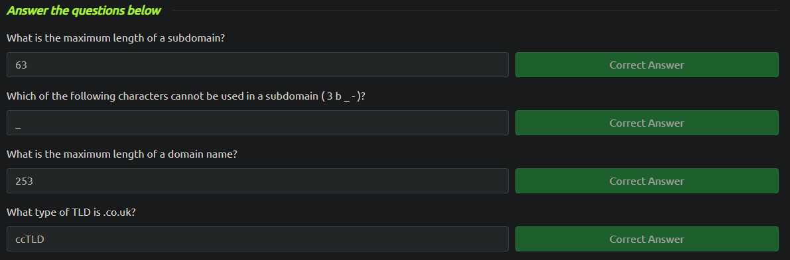
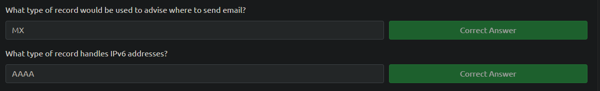
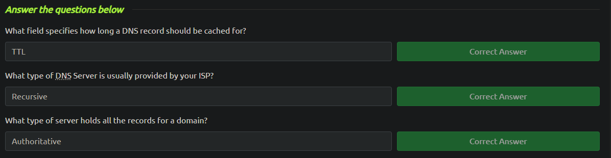
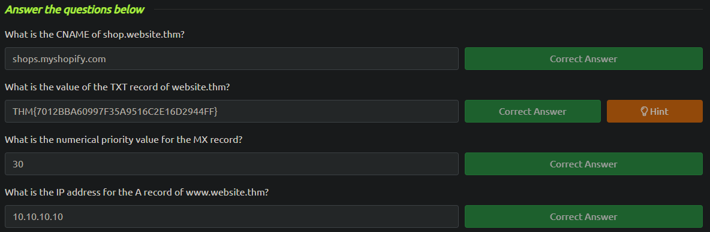

<h3>How The Web Works</h3>

<b>DNS</b> stands for Domain Name System. Much like every house has a unique address for sending mail directly to it, every computer on the internet has its own unique (IP) address. DNS provides a way to communicate with devices on the internet without remembering IP addresses. Instead of remembering 104.26.10.229, you can remember tryhackme.com instead.

DNS has a thing called domain hierarchy which has three parts: TLD (Top-Level Domain), Second-Level Domain and Subdomain.

The <b>hierarchy</b> of DNS starts from the root domain, represented by a dot (.). Below the root, there are <b>top-level domains (TLDs)</b> like .com, .org, .net, etc. Beneath TLDs, there are <b>second-level domains (SLDs)</b>, followed by <b>subdomains</b> and <b>hostnames</b>. This hierarchy is organized from right to left, with each level separated by dots. Let's use www.shop.example.co.uk as an example that has the complete domain hierarchy represented:

- Root domain: "."
- Top-Level domain: ".uk" (country-code Top-Level domain for the United Kingdom)
- Second-level domain: ".co.uk" (commercial domain within the UK)
- Subdomain: "example" (a subdomain of "co.uk")
- Hostname: "shop" (a hostname within the subdomain "example")

DNS <b>record types</b> serve various purposes in mapping domain names to specific IP addresses or providing other information about domain names. The most common ones that you're likely to come across are:

- <b>A Record</b> which maps a domain name to an IPv4 address
- <b>AAAA Record</b> which maps a domain name to an IPv6 address
- <b>CNAME Record</b> which resolve to another domain name. For example, TryHackMe's online shop has the subdomain name store.tryhackme.com which returns a CNAME record shops.shopify.com
- <b>MX Record</b> which specifies the mail server responsible for receiving email on behalf of a domain.
- <b>TXT Record</b> which allows domain owners to add arbitrary text to their DNS records, often used for verification or documentation purposes.

When making a DNS request:

1. <b>Local Cache Check</b>: Your computer first checks its local cache for the IP address associated with the domain name. If found, the request ends here.

2. <b>Recursive DNS Server Request</b>: If not found locally, a request is sent to the Recursive DNS Server (usually provided by your ISP), which also checks its cache. If found, the IP address is returned to your computer.

3. <b>Root Server</b>: If not found in the Recursive DNS Server cache, the request is directed to the root DNS servers. These servers redirect the request to the appropriate Top Level Domain (TLD) server based on the domain's TLD.

4. <b>TLD Server</b>: The TLD server directs the request to the authoritative server (nameserver) for the domain.

5. <b>Authoritative Server</b>: The authoritative server holds the DNS records for the domain. It returns the IP address associated with the domain to the Recursive DNS Server.

6. <b>Response</b>: The IP address is cached in the Recursive DNS Server and returned to your computer. The TTL value determines how long the response is cached.

This process ensures efficient resolution of domain names to IP addresses, reducing the need for repeated DNS requests.

Finally, a small task where DNS queries are made with the nslookup command.

