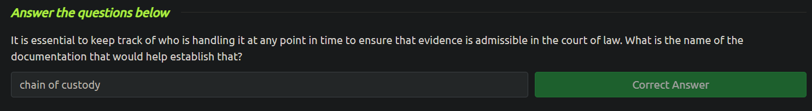
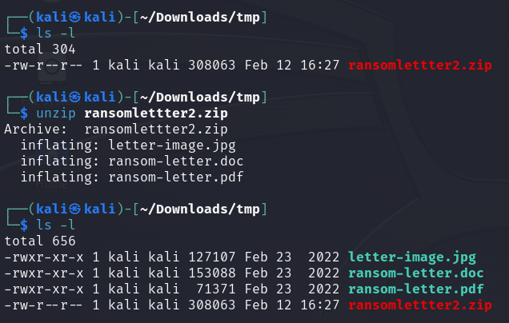
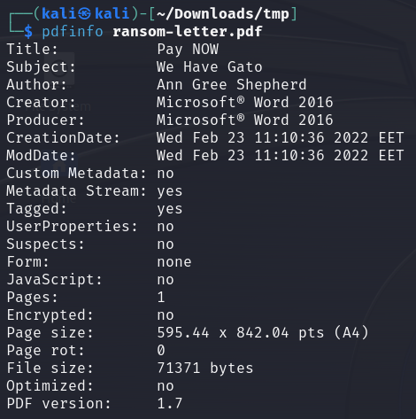
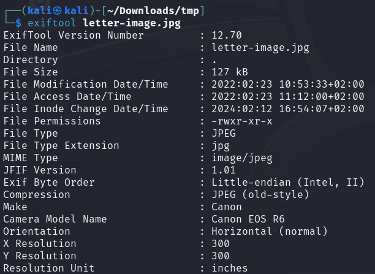
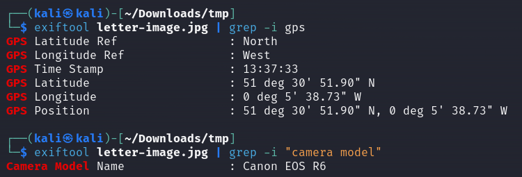
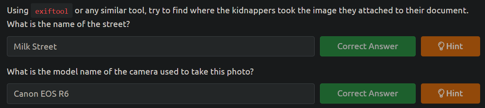

<h2>Intro to Digital Forensics</h2>

**_Digital forensics_** addresses crimes involving digital systems like computers and smartphones. It involves collecting, transferring, and analyzing digital evidence, necessitating specialized procedures due to the vast amounts of data involved. **_Public-sector_** investigations are conducted by government agencies and law enforcement agencies, while **_private-sector_** investigations are carried out by corporations. Both rely on digital forensics to uncover evidence from digital devices and media. Trained investigators are crucial for processing digital evidence accurately.

according to the former director of the Defense Computer Forensics Laboratory, digital forensics includes:

- Proper search authority: Investigators cannot commence without the proper legal authority.
- Chain of custody: This is necessary to keep track of who was holding the evidence at any time.
- Validation with mathematics: Using a special kind of mathematical function, called a hash function, we can confirm that a file has not been modified.
- Use of validated tools: The tools used in digital forensics should be validated to ensure that they work correctly. For example, if you are creating an image of a disk, you want to ensure that the forensic image is identical to the data on the disk.
- Repeatability: The findings of digital forensics can be reproduced as long as the proper skills and tools are available.
- Reporting: The digital forensics investigation is concluded with a report that shows the evidence related to the case that was discovered.

In the next task, I have to examine the metadata of the files. This is a step-by-step tutorial using the tools needed it was easy enough to do.

I had to download a zip folder, inside which the files were found. Below is a picture of the zip folder and the files inside it

Next, we were taught to examine metadata from a pdf file. Here we used the `pdfinfo` tool to find the answer to the question.

Next, we were taught to examine metadata from the image file. Here we used the `exiftool` to find the answer to the question.

The png file had a lot of metadata. in order to find the desired information, we had to use the `grep` tool. Below are examples how I used the grep.

In google maps replace the word dec with symbol °. For this exercise, put the following coordinates to the search field to get the answer: `51°30'51.9"N 0°05'38.7"W`

