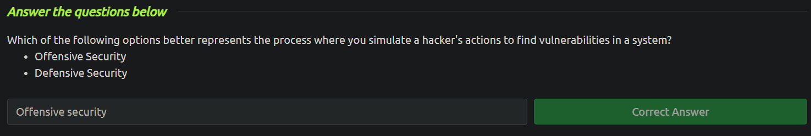

<h2>Intro to Offensive Security</h2>

**_Offensive security_** is the process of breaking into computer systems, exploiting software bugs, and finding loopholes in applications to gain unauthorized access to them. **_Defensive security_** is the process of protecting an organization's network and computer systems by analyzing and securing any potential digital threats.

The next task was to do a hack using the GoBuster program, which was given step-by-step instructions. The task was to transfer some money from another bank account to your account and get the answer for the guestion

In summary, this was a really short introduction to the topic.
