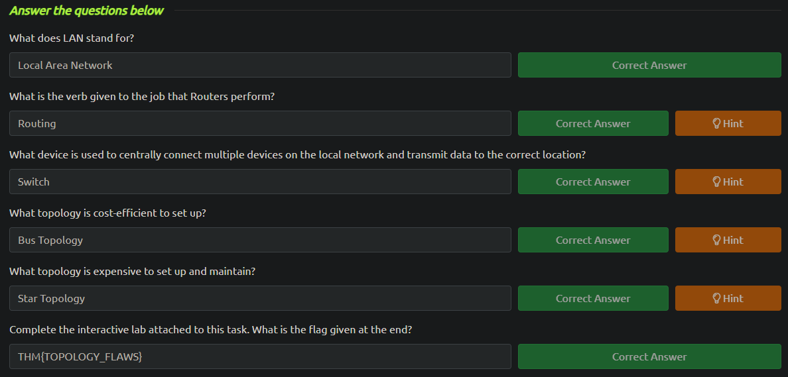
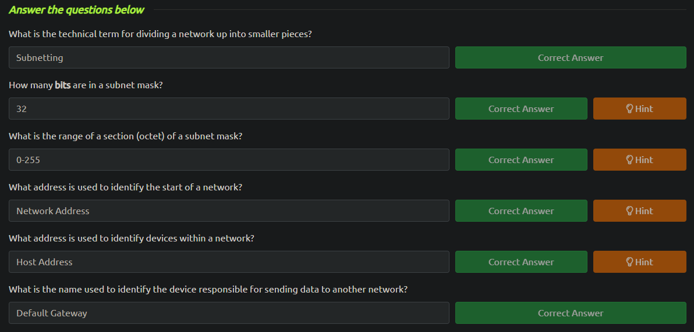
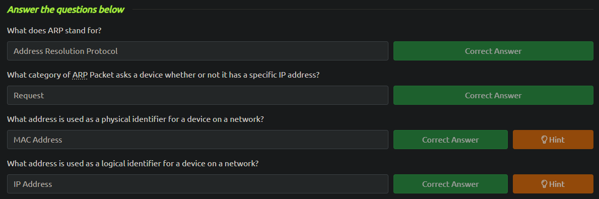

<h2>Network Fundamentals</h2>

<h3>What is Networking?</h3>

The Internet's initial version, ARPANET, emerged in the late 1960s under US Defense Department funding. However, it wasn't until Tim Berners-Lee invented the World Wide Web in 1989 that the Internet began to function as a platform for storing and sharing information, similar to its modern usage.

An <b>I</b>nternet <b>P</b>rotol address (or IP address) can be used as a way of identifying a host on a network for a period of time. An IP address is a set of numbers divided into four octects. For example a private IP address is 192.168.1.1 and a public IP address is 86.157.52.21. A <b>public IP address</b> is used to identify a device on the Internet, while a <b>private IP address</b> is utilized for communication within a local network.

<b>IPv4</b> has 2^32 IP addresses (4,29 billion) while <b>IPv6</b> supports up to 2^128 of IP addresses (340 trillion-plus).

The MAC (<b>M</b>edia <b>A</b>ccess <b>C</b>ontrol) address is a unique identifier assigned to network interfaces for communication on a physical network. It's used to distinguish devices on a network and is typically hardcoded into the hardware, providing a permanent and unique identity for each device.
A MAC address is a twelve-character hexadecimal number separated by colons, with the first six characters indicating the manufacturer of the network interface and the last six serving as a unique identifier for the device.

MAC addresses can be spoofed, meaning a device can pretend to be another by using its MAC address. This can disrupt security measures, like firewalls configured to trust specific MAC addresses. Public Wi-Fi hotspots often utilize MAC address control for better service, such as offering faster connections for a fee per device.

<b>Ping</b> is a fundamental network tool that measures connection performance using <b>ICMP</b> packets. It determines if a connection exists and its reliability. Pings measure the time ICMP packets take to travel between devices using echo and echo reply packets. This tool is commonly used to test devices on a network or websites and is pre-installed on operating systems like Linux and Windows. An example of ping would be `ping 192.168.1.254`.

<h3>Intro to LAN</h3>

Bus, Star, and Ring Topologies:

- Bus: Devices connect to a single backbone cable, prone to bottlenecks and single point failures.
- Star: Devices connect individually to a central networking device, offering reliability and scalability.
- Ring: Devices form a loop, minimizing cabling but susceptible to network-wide disruptions if a fault occurs.

Router and Switch:

- Router: Connects networks, routes data between them, providing redundancy but potentially impacting performance.
- Switch: Aggregates devices in a network, efficiently manages traffic by sending packets only to intended devices.

<b>Subnetting</b> is the process of dividing a single network into multiple smaller sub-networks, allowing for more efficient use of IP addresses and improved network management. Subnets use IP addresses in three different ways:

- Identify the network address
- Identify the default gateway
- Identify the host address

Subnetting provides a range of benefits, includin efficiency, security and full control.

The <b>A</b>ddress <b>R</b>esolution <b>P</b>rotocol (<b>ARP</b>) is responsible for associating MAC addresses with IP addresses on a network. Devices use ARP to find the MAC address of a device for communication by broadcasting an ARP request. When a device with the requested IP address responds, an ARP reply is sent back, allowing the initiating device to store the association in its cache for future reference.

<b>D</b>ynamic <b>H</b>ost <b>C</b>onfiguration <b>P</b>rotocol (<b>DHCP</b>) is a network protocol used to automatically assign IP addresses and other network configuration parameters to devices on a network. Instead of manually configuring each device with its IP address, subnet mask, default gateway, DNS servers, etc., DHCP enables a server to dynamically allocate these parameters to devices when they connect to the network. This simplifies network administration and ensures efficient use of IP addresses.

