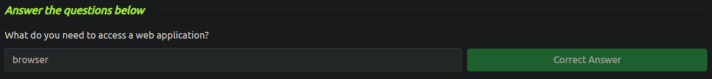
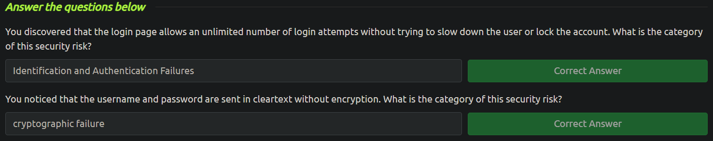
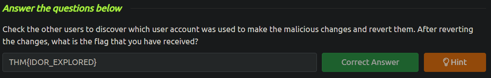

<h2>Web application Security</h2>

Web applications run on remote servers, accessible via web browsers without installation. They offer services like webmail, online office suites, and shopping, interacting with databases for data retrieval and storage. Security is crucial to prevent data theft. Users interact with web apps through browsers, hiding the technical infrastructure.

Web application transactions typically involve logging in, searching for products, adding items to the cart, specifying shipping details, and providing payment information. Common attacks target these steps:

- **_Log-in_**: Attackers may use automated tools to try numerous passwords to gain unauthorized access.
- **_Product search_**: Attackers might manipulate search terms to extract sensitive data or execute unauthorized programs.
- **_Payment details_**: Attackers may exploit weak encryption or cleartext transmission of payment data.

Key vulnerabilities include:

- **_Identification and Authentication Failure_**: Weaknesses in confirming user identity and validating passwords.
- **_Broken Access Control_**: Allowing unauthorized access to files or accounts due to inadequate permission settings.
- **_Injection_**: Allowing malicious code to be inserted through user input due to lack of validation.
- **_Cryptographic Failures_**: Weaknesses in encryption methods or transmission protocols, such as sending sensitive data over HTTP instead of HTTPS, or using weak encryption algorithms or keys.

**_Direct Object References_** (IDOR) is a a type of Broken Access Control. It allows attackers to access unauthorized information or perform actions. It occurs when a web application fails to validate user permissions for accessing objects. For example, by manipulating URLs, attackers can access sensitive data, such as customer accounts or unreleased products. This vulnerability can lead to severe consequences, like sabotage in systems such as an Inventory Management System, where wrong items are assigned to assembly lines.

The small task in this room is to provide the correct URL for a user and find the 'flag'. The question is as it follows: "Check the other users to discover which user account was used to make the malicious changes and revert them".

