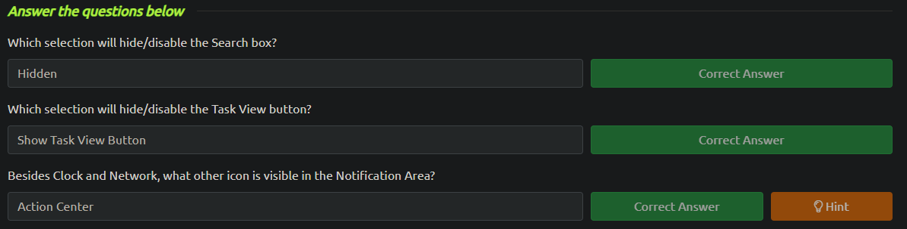
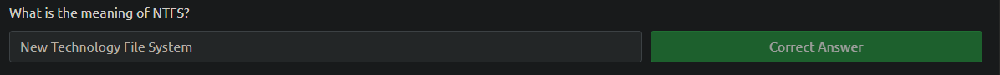
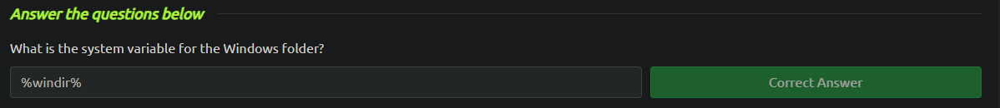
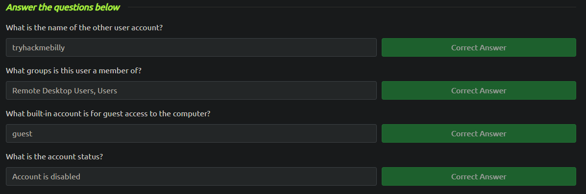
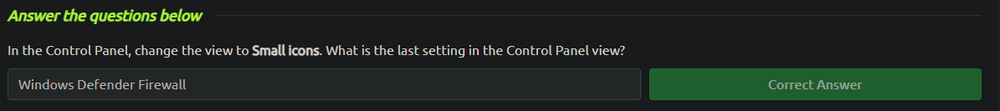
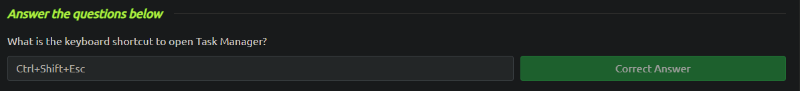

<h3>Windows Fundamentals 1</h3>

After accessing the virtual machine via [Remote Desktop](https://www.cyberark.com/resources/threat-research-blog/explain-like-i-m-5-remote-desktop-protocol-rdp) with command we can start learning new things. To connect a virtual machine with Linux is:

`xfreerdp /v:ip_address /u:administrator /p:letmein123!`

The Windows operating system has a long history dating back to 1985 and is currently the dominant operating system.

Basically this first part tells the basics of the Windows graphical user interface and then has few questions about

New Technology File System (NTFS) is the file system used in modern versions of Windows. Before NTFS, there was FAT16/FAT32 (File Allocation Table) and HPFS (High Performance File System). More about File and folder permissions [here](<https://learn.microsoft.com/en-us/previous-versions/windows/it-pro/windows-2000-server/bb727008(v=technet.10)>).

The folder which contains the Windows operating system is traditionally at C:\Windows. However it can be other drive and folder as well. the system environment variable for the Windows directory is `%windir%`.

There are two types of user accounts: <b>Administrator</b> and <b>Standard User</b>. The difference between the user types are:

- An Administrator can make changes to the system: add users, delete users, modify groups, modify settings on the system, etc.

- A Standard User can only make changes to folders/files attributed to the user & can't perform system-level changes, such as install programs.

One way to to access information about users and groups is run command `lusrmgr.msc`.

Now the task is to use the RDP connection and find the answers to the questions below:

In a nutshell, <b>User Account Control</b> (UAD) prompts users for permission or confirmation before allowing applications or tasks that require administrative privileges to run. This helps ensure that only trusted and authorized actions are performed on the system, reducing the risk of malware infections and unauthorized system modifications.

The last part was about the Task Manager. Basic things like how to see your CPU and RAM usage and so on.

Hurray, we have completed the first part of the Windows Fundamentals!
